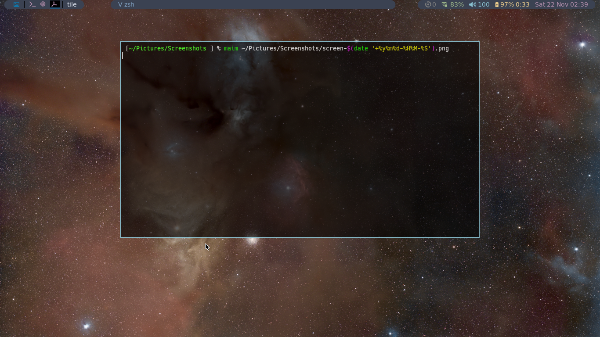

Simple-ish qtile configs that appear to have 3 pill-shaped bars that can float by uncommenting the margins as the bottom of the "Screen" definition, and Scratchpads for a terminal and an ncmpcpp player.
The require Nerd Fonts (https://www.nerdfonts.com/#home).
The far left widget loads a random wallpaper at startup and every time it is clicked.

Ver. 2 uses the qtile-extras package, which can cause problems when it and the qtile package are out of sync.

Ver. 3 looks identical, but it uses text boxes and icons to achieve the same pill-shape effect.

The wallpaper is not available, but it is an astro-photograph that a friend took of the Rho Ophiuchi Region on 26 Jul 2025.

